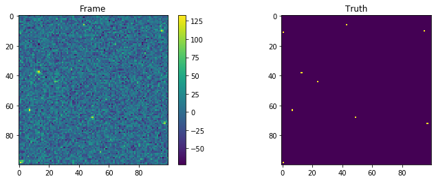
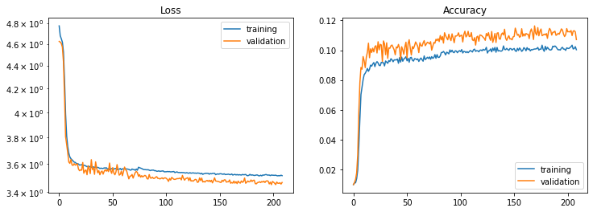
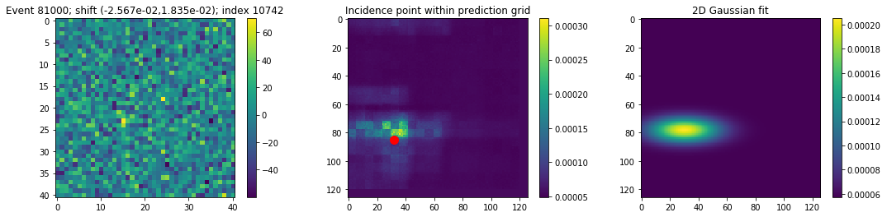

# EMSim Notes

## 26 JUL 2021: frame generation

A random frame containing many electron events can be generated by:
- initializing the frame as a 2D array of all 0's
- casting a random number for the number of electrons to be generated Ne
- for each of Ne electrons:
    - casting a random number corresponding to the central pixel of the electron
    - choosing an event at random from a dataset of single-electron events
    - adding the pixel values of the randomly chosen single-electron event to the frame, centered upon the chosen pixel
- add a specified amount of noise to the entire frame

Here are several events constructed in this way without noise, for a frame size of 100x100 and 10 +/- 1 electrons per frame:

And with Gaussian noise (mu = 0, sigma = 20):

Here is a 576x576 frame with many (2927.294 +/- 70.531 used in generating the random number), shown on a log scale.

## 24 JUL 2021

Training a net with a 10x10 prediction grid and no displacement of the
central pixel seems to give better results for the neural net. Here we trained
with learning rate 1e-3 for 73 epochs and then 1e-4 for the rest:

Here are the errors in the determined positions (note that in the case of the 3x3
centroid method, the pixel of electron incidence was still assumed to be the one with the most charge, and not the central pixel):

Here it looks like the NN gives similar performance for well-identified events. In fact, some of these events in the longer shoulder of the NN
distribution must actually correspond to events with much larger error using the 3x3 method. Looking at the error differences,

perhaps there is still a slight asymmetry in favor of the 3x3 centroid for
low error differences, but the NN still seems to give similar performance.

We note that the above comparison was somewhat unfair - the NN was essentially
restricted to predicting within the central pixel (some predictions fell outside
of this because the incident location was taken to be the mean of the 2D Gaussian,
which may have been outside the 10x10 grid for events near the edge) while the
3x3 method was not told that the central pixel was correct. If we now:

- demand for the 3x3 method that the central pixel is always correctly chosen
- use the point of maximum predicted probability within the 10x10 grid for the NN (not the mean of the Gaussian fit)

Here are the errors:

`Mean 3x3 error -- 0.0011584349887750222` 
`Mean NN error --- 0.0011583734270575604`

and the error differences

## 23 JUL 2021

The net was trained further with a prediction grid of 126x126 with learning rates of 1e-3, 1e-4 (first jump in loss) and 1e-5 (2nd jump in loss):

It looks like most additional gains were made with the 1e-4 learning rate. Looking
at an individual event (using the model after the training with the 1e-4 learning rate):

It looks like the uncertainty of the net prediction is still high, and we can also
see the structure of the 21x21 event pixels on the 126x126 prediction grid.

## 22 JUL 2021

The net should be able to match the standard method at low error. Maybe there is a way to weight the loss toward easier clusters, but I would think that already the net is getting more exposure to easier events as there are more of them. Looking at the NN error minus the 3x3 (0 threshold) error, it looks like when the error difference is less than 2 pixels, the NN is more likely to give greater error (the difference is positive):

However for large error differences, the NN "wins":

I guess this is just another way of looking at what we already understood from the previous plots. Now with the NN "knob" at the ~80% efficiency level:

So the knob seems to help the NN much more than the standard method, but still at pixel-level error differences the standard method seems to win by a bit.

I tried to use the Gaussian mean rather than the highest probability error pixel, and it didn't seem to help. Maybe a finer grid would help - perhaps I could try 126x126, dividing each pixel into 6x6

I've done an initial training on a 126x126 prediction grid, so far just the round with the higher learning rate (1e-3):

It looks like the predicted region gets cloudier:

I'll keep going with learning rate 1e-4, but I think the grid may be getting too fine (maybe I need to increase the size of the net to get enough parameters to get a good fit). I may want to run these tests with no displacement of the central/max pixel and over a 10x10 grid (covering the 1 pixel we know for sure is the one corresponding to electron incidence), just to make sure that in the simplest case the NN can match the performance of the basic centroid method. Then we can expand to the wider field-of-view with the +/- 10 pixel shift.

## 21 JUL 2021

Here is a "scatter matrix" of the errors for 10000 validation events, noise sigma = 20:
- error_r_NN: the error on the NN-predicted quantity (pixel with max prediction on the 84x84 grid spanning 21x21 pixels)
- error_r_maxpt: the error when the center of the pixel (in the 41x41 event) with maximum counts is used as the electron location
- error_r_3x3: the error when the centroid of the 3x3 region around the maximum pixel (in the 41x41 event) is used
- error_r_3x3_th: same as error_r_3x3 except only using pixels above a threshold of 40 counts
- error_r_5x5:the error when the centroid of the 5x5 region around the maximum pixel (in the 41x41 event) is used
- error_r_5x5_th: same as error_r_5x5 except only using pixels above a threshold of 40 counts

Here the non-NN errors are more correlated, and it looks like the number of events with (low NN error) and (high error in the non-NN quantities) is greater than vice versa, that is, that the NN seems to be "way off" on fewer events. However, looking more closely at the region of low error (here we compare the NN vs. the 3x3 thresholded centroid):

It looks like the net actually does worse overall, for the events with low error, than the 3x3 thresholded method (probably those for which we get the right pixel by choosing the one with maximum counts). Perhaps the NN could be improved by:
- increasing the resolution of the prediction grid
- using the mean of the Gaussian fit as the predicted location rather than the center of the maximum pixel in the prediction grid

Either way it's still hard to tell at this point how much the NN will actually gain for us, if anything. It does include the "knob", but perhaps we could compute a different non-NN "knob" factor and gain a similar amount.

Here are the scatter plots zoomed < 0.01:

## 19 JUL 2021

I've continued the training for a few hours after the epoch where it was previously left off (epoch 244). There seems to be a sharp drop in accuracy and increase in loss at that point - I thought I continued with the same learning rate as previously, so I am surprised by this break. It seems to recover slowly:

During the initial training I also stopped it and decreased the learning rate a few times to try to improve the results. I started with 1e-3 and then changed to 1e-4. I thought I also ran with 1e-5 for some epochs, though I may not have (that would explain the sudden change in this most recent training run). I could try training again from the beginning, perhaps staying at 1e-3 for longer.

## 17 JUL 2021

I've implemented the gaussian-based sigma determination:
sigma_x and sigma_y are now determined by fitting to: A\*np.exp(-0.5\*((X-x0)^2/(varx)+(Y-y0)^2/(vary))) + C: the initial values are determined by
- the maximum pixel value (A)
- the maximum pixel location (x0,y0)
- the squared sigmas computed over the entire grid, excluding pixels less than a threshold equal to 1/10 of the max pixel value (varx,vary)
- 1/10 of the max pixel value (C)

The final sigma is the squared sum of the sigmas from the Gaussian fit in x and y.

**Here is an example event for several different noise generations, now showing the Gaussian function constructed from the fit parameters**

**The mean errors and sigmas for 10k validation events**

**The mean errors and sigmas for sigma < 0.011 (~80% efficiency)**

**The efficiency curve**

## 16 JUL 2021
Here is the summary of the current progress:

**The network training loss and accuracy** (80k training events, 20k validation); not sure why validation set seems to significantly outperform (due to dropout in training?)

**An example event from the validation set**

**For 5k of the validation events, the errors on the predicted (x,y) values and the calculated sigmas ||<x^2> - <x\>^2, <y^2> - <y\>^2)|| of the predicted probability distributions**

**For the same 5k validation events, the mean error given a cut on the sigma < sigma_cut, with sigma_cut varied between 0.035 and 0.045**

**To illustrate the effect of the "knob" for a specific point on the curve above:**
same distributions of errors on the predicted (x,y) values and the calculated sigmas of the predicted probability distributions, but now with a cut of sigma < 0.041 (gives ~68.5% efficiency)

Note: the efficiency vs. error curve is only shown above for a range of sigma cuts between 0.035 and 0.045 because strange things happen at lower sigma: here is the plot for 0.025 to 0.045 (not connecting the dots); the efficiencies at these lower sigmas are probably too low to be of interest anyway

## 15 JUL 2021

I've managed to add to the EM network training:
- shifting of the events by +/- 10 pixels in either direction. As the original 101x101 events were reduced to 21x21 and a 10-pixel shift from the center would start cutting off the patterns, I've expanded the events an additional 10 pixels in each direction, per dimension, so the events are now 41x41 when input to the net
- training of the network to cover a 21x21 pixel range, so the final grid spans 20*0.005 + 0.0025 = 0.1025 in each dimension

So far, I've tried several different grid sizes, most recently 80x80 (perhaps I should use 84x84 so an integer number of grid cells corresponds to 1 pixel). Here is the same event with different shifts on the 80x80 prediction grid:

It looks like the strategy is more or less working. Right now we're dividing each pixel into roughly 4x4. How fine do we want to make the grid? Do we need to be more precise than ~1.25 micrometers in each dimension?

I will now see how this works with 20 e- of noise

Here is the first attempt to train with noise (same event as in previous email, now with noise and different shifts). This is an event from the validation set, with several different shifts + noise; the images on the right are the predictions and true locations (red dot):

It trained on 8k events for ~900 epochs. I think it can learn more, especially with more events, though I'm not sure how much more. I will try:
- a 100k event set (80k training, 20k validation)
- similar grid sizes (41x41 events, 84x84 prediction grid)
- looking at prediction error vs. some quantity describing the sharpness of the prediction distribution, perhaps sqrt(sigma_x^2 + sigma_y^2)

## 13 JUL 2021

Here are the errors in the predictions (since the prediction is constrained to be one of 100 points on the 10x10 grid while the incident location could be anywhere within the grid, there is almost always some error)

Here are a few events that had very high error (> 0.002 mm in the x-position):

For these it looks like something just went wrong in the network because the error distributions still seem sharp (maybe needs more training with more events). Now looking at events with some error but less dramatic (> 0.001 mm in the x-position):

## 11 JUL 2021

An update on progress on the network: I've managed to train a net that seems to be giving reasonable initial results:
- starting from the events centered on the pixel in which the electron was incident, with no noise added; I've reduced the size to the central 20x20 region for these initial tests
- dividing the central pixel into a 10x10 grid on which the precise incident location is predicted (so each bin corresponds to 0.5 micrometers of space - we could go to higher resolution if needed)
- training the network to produce a probability distribution over the 10x10 grid; the "label" is the grid filled with a 1 in the bin in which the incident location falls, and 0s everywhere else
- 8k events training set, 2k validation

While the training "accuracy" (whether or not the highest-probability predicted bin corresponds to the true bin) seems to peak at ~40% for a convolutional network, it looks like most predictions are "correct" to within about 1 bin. Here are a few examples from the validation set - using the 4 micrometer, 300 keV data cropped to 20x20 about the central region - left plot is the event, right plot is the distribution over the 10x10 grid with the true bin marked with a red dot. Note the red dot marks the center of the true bin, not the absolute location, which would not always be a bin center:

Some thoughts on this:
- it will be interesting to see how things look once some noise is added. I think that for now we could keep the correct central bin and just add noise, so identifying the correct central bin we assume "solved" for the moment. With this we may start to see events that perform poorly, and perhaps the probability distribution will be less peaked, reflecting the net's confusion with these events.
- we could go back to 100x100 events if necessary - I had cropped to 20x20 to remove the non-central region which seems to be all 0s (though won't be once we introduce noise). Is there a reason we should use 100x100 events rather than cropping them nearer to the central region?

## 09 JUL 2021

I'm attempting to select the amount of noise to include in the electron EM-ML study.

After applying the noise, the new "center" of the event is now determined by finding maxima over 3x3 regions, starting with the 3x3 region containing the maximum pixel, and then trying the 3x3 region surrounding the 2nd-highest pixel. If the 3x3 region surrounding the 2nd-highest pixel actually had a higher sum, we check the 3rd highest, and so on until the next-highest gives a lower 3x3 region sum, in which case we stick with the maximum pixel we are on with the highest 3x3 region sum.

Using this strategy, here is the average error sqrt(xerr^2 + yerr^2) vs. the sigma of the noise in electrons (using 1000, 300 keV events - error bars are the error on the mean = r_sigma/sqrt(1000)):

The curve seems to be asymptoting at a value equal to about half the distance from the center to one corner of the square (0.5 mm side length), which would be sqrt(2)\*(100 pixels / 2)\*(5 micrometers) / 2 = 0.177 mm. I suppose this corresponds to the point at which the maximum pixel is essentially chosen randomly because the noise dominates most events (though I would have expected this value to lie between 0.177 mm and 0.177 mm / sqrt(2) = 0.125 mm, as the corner is the farthest-reaching point of the square).

I'm not sure where on this curve we should be operating, though for now I will choose something like sigma_noise = 20 electrons.
